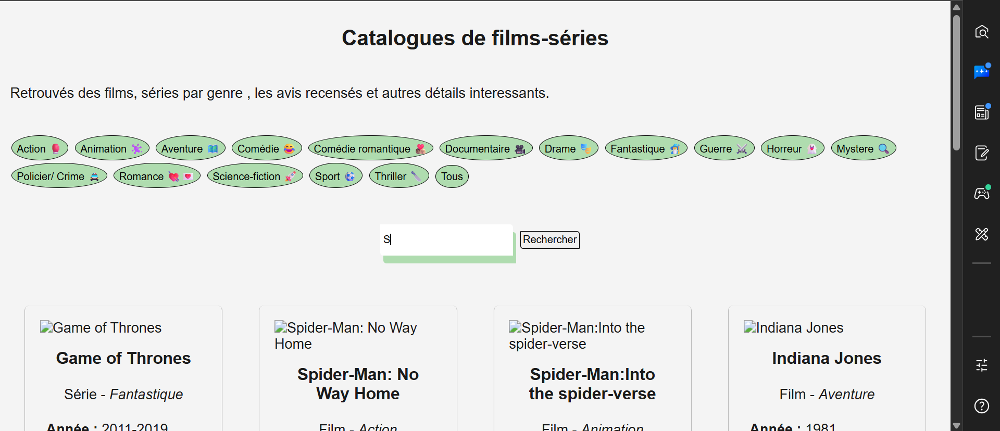

# catalogues-films-series
Obtenez des informations et détails que vous ignorez sur vos Films et Séries préférés

Un site interactif pour voir des films et series, consulter leurs cartes pour voir des informations utiles sur ces derniers. 

## Fonctionnalités
- Filtre selon le genre voulu
- Recherche d'un film ou d'une série précise

## Démo
👉🏼[Voir la demo en ligne](https://hissene-credo.github.io/catalogues-films-series/)

## Stack technique
HTML/ CSS/ JavaScript (vanilla, sans framework)

## Lancer le projet en local
1. Cloner le repos : `git clone https://github.com/hissene-credo/catalogues-films-series.git`
2. Ouvrir index.html dans un navigateur

## Roadmap
- [ ] Refonte de l'interface UI/UX
- [ ] Affichage des cartes avec des détails supplémentaire ( résumé, auteurs,...)

## Contexte
Projet réalisé dans le cadre de ma montée en compétence en développement front-end (JavaScript DOM, génération dynamique, CSS responsive) 
